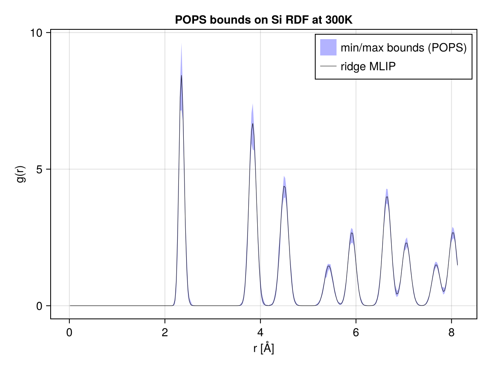

\theta_0,N```@meta
CurrentModule = POPS
```

# Example: Molecular Dynamics

This example shows how to propagate model uncertainties from the ACE example to molecular dynamics trajectories. We use the same potential as the [ACE](ace.md) example.
A single trajectory of molecular dynamics is performed, using [Molly.jl](https://github.com/JuliaMolSim/Molly.jl) on a bulk silicon system under the *mean* potential (corresponding to the ridge regression parameter).

A reweighting procedure is then applied to estimates of a thermodynamic property — here the radial distribution function (RDF) — obtained from the trajectory. The reweighting procedure relies on the simple idea of importance sampling, or Boltzmann reweighting.


## Theory: Boltzmann reweighting

Suppose we have a trajectory of atomic configurations ``\{q_i\}_{i=1}^N`` obtained from MD sampling (or any Boltwmann sampling scheme, for that matter) of the potential energy surface defined by the ridge regression parameter ``\theta_0``. We estimate the expectation of any observable ``f(q)`` using the trajectory average

```math
\hat{f}_{\theta_0,N} = \frac{1}{N} \sum_{i=1}^N f(q_i) \xrightarrow{N \to \infty} \left(\int f(q) \mathrm{e}^{-\beta U(q;\theta_0)} \mathrm{d}q\right) \bigg/ \left(\int \mathrm{e}^{-\beta U(q;\theta_0)} \mathrm{d}q\right).
```

Now for $\theta\neq\theta_0$, using the identity

```math
\left(\int f(q) \mathrm{e}^{-\beta U(q;\theta)} \mathrm{d}q\right) \bigg/ \left(\int \mathrm{e}^{-\beta U(q;\theta)} \mathrm{d}q\right)
= \left(\int f(q) \frac{\mathrm{e}^{-\beta U(q;\theta)}}{\mathrm{e}^{-\beta U(q;\theta_0)}} \mathrm{e}^{-\beta U(q;\theta_0)} \mathrm{d}q\right) \bigg/ \left(\int \frac{\mathrm{e}^{-\beta U(q;\theta)}}{\mathrm{e}^{-\beta U(q;\theta_0)}} \mathrm{e}^{-\beta U(q;\theta_0)} \mathrm{d}q\right),
```
we can reweight the trajectory samples to obtain an estimator of the Bolzmann average of $f$ under any potential defined by a parameter sample ``\theta``. More precisely, we compute

```math
\hat{f}_{\theta_0\to\theta,N} =\frac{\sum_{i=1}^N w_i f(q_i)}{\sum_{i=1}^N w_i}, \quad \text{where } w_i = \mathrm{e}^{-\beta (U(q_i;\theta) - U(q_i;\theta_0))}.
```

This allows to efficiently estimate the distribution of thermodynamic averages with respect to a given posterior distribution over model parameters, such as the POPS ensemble.
Here we propagate model uncertainties to estimates of the [radial distribution function](https://en.wikipedia.org/wiki/Radial_distribution_function) (RDF) ``g(r)`` of bulk silicon at 300 K.

After discretization of the RDF in bins of the variable ``r``, the Boltzmann reweighting procedure applies component-wise.

The full script is available in the repository under
[`examples/md/pops_rdf.jl`](https://github.com/noeblassel/POPS.jl/blob/main/examples/md/pops_rdf.jl).

## Fit a POPS ACE potential

The fit is identical in spirit to the [ACE example](ace.md): assemble the
preconditioned linear regression problem, then fit the POPS hypercube. We
keep the full `Si_tiny` dataset for fitting in this example.

```julia
using ACEpotentials, ACEfit
using POPS
using AtomsBuilder
using Molly
using Unitful
using LinearAlgebra, Random, Statistics
using CairoMakie
using ProgressMeter

data_raw, _, _ = ACEpotentials.example_dataset("Si_tiny")

Eref  = [:Si => -158.54496821]
rcut  = 4.0
model = ace1_model(; elements=[:Si], order=3, totaldegree=10, rcut=rcut, Eref=Eref)
n_basis = length(model.ps.WB) + length(model.ps.Wpair)

weights = Dict("default" => Dict("E" => 30.0, "F" => 1.0, "V" => 1.0))
datakw  = (energy_key="dft_energy", force_key="dft_force", virial_key="dft_virial")
data    = [ACEpotentials.AtomsData(s; weights=weights, v_ref=model.model.Vref, datakw...)
           for s in data_raw]

A, Y, W = ACEfit.assemble(data, model)
P  = ACEpotentials.Models.algebraic_smoothness_prior(model.model; p=4)
Ap = Diagonal(W) * (A / P)
Yp = W .* Y

pops = fit(POPSModel, Ap, Yp;
    prior_covariance=1e-4,
    leverage_percentile=0.1)

θ0_pre  = vec(pops.coef)     # coefficients in preconditioned basis
θ0_orig = P \ θ0_pre         # coefficients in native coordinates
ACEpotentials.Models.set_linear_parameters!(model, θ0_orig)
```

## Molecular dynamics trajectory

We now run MD using the ridge potential. A 3×3×3 supercell of
diamond silicon is equilibrated for 2 ps, then sampled for 20 ps with the BAOA
Langevin integrator. For each frame we record both the pair-distance histogram
and the per-basis ACE energy features — the latter will let us reweight samples without
re-running MD.

```julia
T_md = 300.0u"K"
sys0 = bulk(:Si, cubic=true) * (3, 3, 3)   # 216 atoms
rattle!(sys0, 0.03)

sys_md = Molly.System(sys0; force_units=u"eV/Å", energy_units=u"eV")
sys_md = Molly.System(sys_md;
    general_inters=(model,),
    velocities=Molly.random_velocities(sys_md, T_md))

simulator = Langevin(dt=1.0u"fs", temperature=T_md, friction=1.0u"ps^-1")

Molly.simulate!(sys_md, simulator, 2_000)   # equilibration

function pair_histogram!(h, sys, edges)
    fill!(h, 0)
    coords, boundary = sys.coords, sys.boundary
    rmax, dx, nb, n = edges[end], step(edges), length(h), length(coords)
    @inbounds for i in 1:n-1, j in i+1:n
        r = norm(Molly.vector(coords[i], coords[j], boundary))
        r ≥ rmax && continue
        b = clamp(Int(fld(ustrip(r), ustrip(dx))) + 1, 1, nb)
        h[b] += 1
    end
    return h
end

n_frames, chunk_steps, n_bins = 200, 100, 300
r_max = 8.14u"Å"
edges = range(0.0u"Å", r_max, length=n_bins + 1)

ace_features_buf = zeros(n_basis, n_frames)
histos_buf       = zeros(Int, n_frames, n_bins)
h_buf            = zeros(Int, n_bins)

@showprogress for i in 1:n_frames
    Molly.simulate!(sys_md, simulator, chunk_steps)
    Xi = ACEpotentials.Models.potential_energy_basis(sys_md, model)
    ace_features_buf[:, i] .= ustrip.(u"eV", Xi)
    pair_histogram!(h_buf, sys_md, edges)
    histos_buf[i, :] .= h_buf
end
```

## Reweighting to the POPS posterior

For each posterior parameter sample ``\theta`` drawn from the POPS hypercube,
we compute the energy difference along the trajectory, and apply the Boltzmann weight to obtain samples of the
RDF that could have been obtained if the dynamics had been run with
``\theta`` instead of the ridge solution ``\theta_0``. The min/max envelope
across posterior samples gives a non-parametric uncertainty band.

```julia
function rdf_normalize(h_avg, edges, sys)
    N    = length(sys.coords)
    Vbox = ustrip(u"Å^3", Molly.volume(sys))
    e    = ustrip.(u"Å", collect(edges))
    n_pairs_ideal = N * (N - 1) / 2
    g = similar(h_avg, Float64)
    for b in eachindex(h_avg)
        shell = (4 / 3) * π * (e[b+1]^3 - e[b]^3)
        g[b]  = h_avg[b] / (n_pairs_ideal * shell / Vbox)
    end
    return g
end

n_samples = 2000
S_pre = sample(pops, n_samples; sampling_method=:sobol)
β     = ustrip(u"eV^-1", 1 / (Unitful.k * T_md))

Hf        = Float64.(histos_buf)
g_samples = zeros(n_samples, n_bins)

for s in 1:n_samples
    Δθ_orig = P \ (S_pre[:, s] .- θ0_pre)
    ΔU      = ace_features_buf' * Δθ_orig

    logw  = -β .* ΔU
    logw .-= maximum(logw)            # numerical stability
    w     = exp.(logw)
    Z     = sum(w)

    h_avg            = vec((w' * Hf) ./ Z)
    g_samples[s, :] .= rdf_normalize(h_avg, edges, sys_md)
end

g0   = rdf_normalize(vec(mean(Hf; dims=1)), edges, sys_md)
g_lo = vec(minimum(g_samples; dims=1))
g_hi = vec(maximum(g_samples; dims=1))
```

## Plotting

```julia
r_centers = ustrip.(u"Å", 0.5 .* (edges[1:end-1] .+ edges[2:end]))

fig = Figure()
ax  = Axis(fig[1, 1]; xlabel="r [Å]", ylabel="g(r)",
           title="POPS bounds on Si RDF at 300K")
band!(ax, r_centers, g_lo, g_hi; color=(:blue, 0.3),
      label="min/max bounds (POPS)")
lines!(ax, r_centers, g0; color=:black, label="ridge MLIP", linewidth=0.5)
axislegend(ax; position=:rt)
save(joinpath(@__DIR__, "rdf_pops.pdf"), fig)
```

**Result**



The black line corresponds to the RDF estimated from the ridge trajectory. The blue band corresponds to the min/max bounds obtained from the reweighted RDF ensemble.
